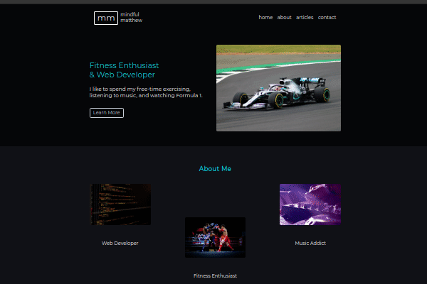

# mindfulmatthew.com live personal blog by mdillemuth

### This is mdillemuth's first live website created by hand using HTML & CSS only. The project is designed with a mobile-first responsive layout and was created to practice my web development skills.

## Showcase 

## Features 
- Mobile-first design
- Responsive layout
- Functional contact form
  - Transparent design with background image
- Created with HTML & CSS only
  - No Bootstrap or libraries used

### Obstacles Encountered & Concepts Learned
- Website hosting & maintenance
  - Learning to use Netlify
  - Updating website directly from respository using git push
- Content generation
  - Writing the "About Me" article
  - Creating a modern-looking logo without extensive design work
- Styling background image for transparent form
- Using properly sourced images

### Future Development Goals
- Refactoring HTML & CSS to improve readability for scaling and maintenance
- Creating CSS with SASS to improve scalability
- Content generation
  - Writing articles for the website
